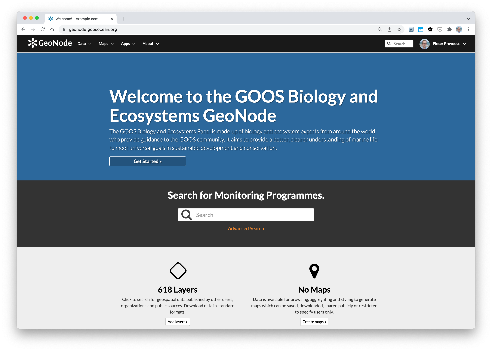

# GOOS BioEco portal documentation

This is the documentation for the GOOS BioEco [portal](https://bioeco.goosocean.org/) and [GeoNode](https://geonode.goosocean.org/). More general GeoNode documentation is available at [https://docs.geonode.org/en/master/](https://docs.geonode.org/en/master/).

The source for this documentation is hosted at [https://github.com/iobis/bioeco-docs](https://github.com/iobis/bioeco-docs).

## How to
### Register your GeoNode account

Lorem ipsum dolor sit amet, consectetur adipiscing elit. Sed feugiat nunc euismod massa interdum porttitor non vel lectus. Vestibulum congue consectetur est, vel lacinia elit. Nunc nec fringilla tortor, non consectetur justo. In hac habitasse platea dictumst. Mauris a ullamcorper massa, laoreet finibus elit. Nullam sed nunc arcu. Duis velit tortor, euismod eu lacus sed, venenatis ultricies magna.

### Add monitoring programs

Lorem ipsum dolor sit amet, consectetur adipiscing elit. Sed feugiat nunc euismod massa interdum porttitor non vel lectus. Vestibulum congue consectetur est, vel lacinia elit. Nunc nec fringilla tortor, non consectetur justo. In hac habitasse platea dictumst. Mauris a ullamcorper massa, laoreet finibus elit. Nullam sed nunc arcu. Duis velit tortor, euismod eu lacus sed, venenatis ultricies magna.

### Update monitoring programs

Lorem ipsum dolor sit amet, consectetur adipiscing elit. Sed feugiat nunc euismod massa interdum porttitor non vel lectus. Vestibulum congue consectetur est, vel lacinia elit. Nunc nec fringilla tortor, non consectetur justo. In hac habitasse platea dictumst. Mauris a ullamcorper massa, laoreet finibus elit. Nullam sed nunc arcu. Duis velit tortor, euismod eu lacus sed, venenatis ultricies magna.