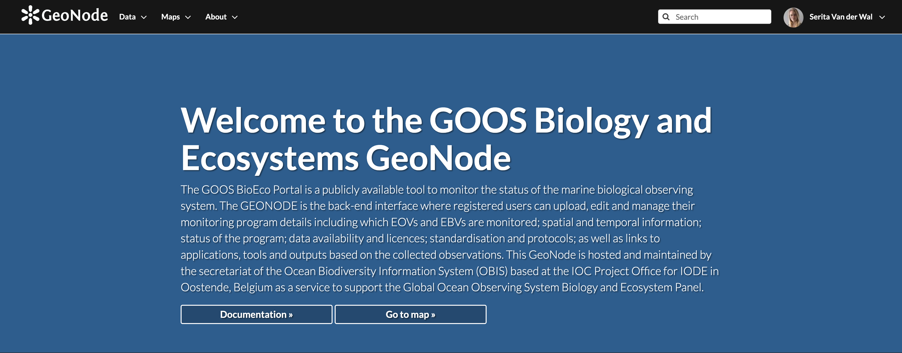

# GOOS BioEco portal documentation

This is the documentation for the GOOS BioEco
[portal](https://bioeco.goosocean.org/) and
[GeoNode](https://geonode.goosocean.org/). More general GeoNode
documentation is available at <https://docs.geonode.org/en/master/>. The source for this documentation is hosted at
<https://github.com/iobis/bioeco-docs>. The full instruction video can be found at <https://www.youtube.com/watch?v=FPUdRK_tZrI>.

## Navigating the GOOS BioEco Portal

[Video: Navigating the GOOS BioEco Portal](https://www.youtube.com/watch?v=FPUdRK_tZrI)

The portal's main interface **(A)** consist of an interactive global map on which the locations of Biological and Ecosystem EOV observations can be seen. Click on a specific location on the map to get a list of programmes for that location. The panel on the left **(B)** shows the total number of programmes currently in the portal as well as the total number of programmes for specific EOVs. The results in the map can be filtered to show specific **(C)** EOVs, **(D)** EOV sub-variables and EBVs by selecting for them in the panel. Filtering can also be done according to the desired Readiness levels **(E)** of a programme. Specific programmes can also be filtered/ searched for by filtering for them by name **(F)** or by selecting from the list.

  

  
When selecting an individual programme, a new panel will open containing all the available metadata for that programme **(G)**, as entered and maintained by the metadata provider for that programme. Clicking on **ZOOM** **(H)** will direct the interactive map to the location of where the monitoring is done, indicated on the map by red dots for individual locations or by a red polygon for areal locations. If no spatial layer is available for the programme, the zoom option is replaced with **NO SPATIAL DATA**. Additioanlly, an option to **REPORT ISSUE** is provided with each programme in case it is needed. 

  

## How to contribute?

[Video: How to contribute](https://www.youtube.com/watch?v=FPUdRK_tZrI&t=216s)

Contribute your programme metadata or explore additional metadata of existing programmes in the portal by navigating to  [GeoNode](https://geonode.goosocean.org/), where new programme metadata is uploaded and existing programme metadata accessed, managed and updated. This documentation and a direct link to the portal is provided on the main page of GeoNode. 

### 1. Register your GeoNode account

[Video: Register your GeoNode account](https://www.youtube.com/watch?v=FPUdRK_tZrI&t=252s)

If you would like to contribute a monitoring programme(s) to the portal, register as a new user or metadata data provider at the top right hand corner of the GeoNode GOOS BioEco homepage. You will be prompted to provide basic details such as an email address, username and password. This personal information will be used solely for the purposes of maintaining a GeoNode account and gaining exclusive access to edit or maintain your programme metadata. This information will not be used or distributed to third parties. 

#### User account and profile

After the details have been completed, you will be signed in and
redirected to the homepage with your username indicated on the top right
hand corner. An arrow next to the username provides a drop down menu
with basic user and account options. From the **Profile** page, personal information and
options can be added, such as a user picture, your organisation, position, location. Interaction with other users is
possible by **Message User** or **Invite Users** 

### 2. Add monitoring programmes

[Video: Add monitoring programmes](https://www.youtube.com/watch?v=FPUdRK_tZrI&t=309s)

GeoNode offers two ways in which new monitoring programmes can be added, which depend on the format of the spatial information of the programme:

#### 2.1 By uplaoding a shapefile (preferred)

[Video: By uploading a shapefile (preferred)](https://www.youtube.com/watch?v=FPUdRK_tZrI&t=322s)

If the spatial information for your programme is in the format of a shapefile, navigate to the **Profile** page. A few
options are available to upload specific data and data types. To create
and upload a new monitoring programme, select **Upload new layers**. Alternatively, select
**Upload Layer** from the **Data** drop down menu on the top toolbar.

Upload your shapefiles by dragging and dropping them to the upload area,
or upload them from your device by using the **Choose Files** option. Uploaded files should not exceed a maximum combined size of 100 MB.

Select the correct charset option for your documents and click **Upload files**.

The permissions panel can be used to set permissions for other GeoNode
users to view, download and edit your uploaded data.

The default options for viewing and downloading data is set as **Everyone**, meaning any GeoNode user. In order to protect your data, specific users or groups must be
specified to be able to change metadata, or edit and manage your data.
If no user/ group is specified, the default for these functions will
remain with the owner user only. 

The upload status will be visible at
the top of the Upload page along with a time stamp of when the layer was
created and the progress. Once the upload is complete, click on the
**Name** of the layer, which will be
identical to the name of the files uploaded. The newly created layer and spatial metadata can be viewed by navigating to your layer and selecting **Metadata detail**. 

  

#### 2.2 Using the GeoNode map tool

[Video: Using the GeoNode map tool](https://www.youtube.com/watch?v=FPUdRK_tZrI&t=376s)

Alternatively, without a shapefile, navigate to the **Profile** page. A few
options are available to upload specific data and data types. To create
and upload a new monitoring programme, select **Create a new layer**. Alternatively, select
**Create Layer** from the **Data** drop down menu on the top toolbar.

Provide the name of your monitoring programme as **Layer name** and **Layer title**. Choose the preferred **Geometry type** for the spatial data and click **Create**.An empty layer has now been created to which you can add your spatial data. Navigate to **Editing tools** and select **Edit data** under **Layer** which will open the map tool in GeoNode.

  

Begin by adding an attribute number in the space provided at **(A)** and select the **Edit mode**. Select **Add New feature** followed by **Draw feature**. Using the mouse, navigate on the map and indicate the location. Alternatively, search for a specific location by name or enter your coordinates at the top right hand corner marked **(B)**. The coordinates of the mouse location can also be viewed by clicking on the mouse icon at the bottom right hand corner marked **(C)**. Save your selected location. 

### 3. Editing programme metadata

[Video: Editing programme metadata](https://www.youtube.com/watch?v=FPUdRK_tZrI&t=493s)

Registered users have exclusive access to edit and update the metadata of their assigned programme. Regular updates of programme metadata is essential to keep the BioEco portal current and representing the true current state and status of ocean observation. In order to do so, we encourage on our metadata providers to keep their programme layer up to date as the programme develops and progresses. 

By selecting **Editing Tools** on the
right hand panel, the spatial- and metadata layer can be edited, removed or updated.  

Only the signed-in owner of a programme and admin have access to edit the metadata of a programme. If the editing tools are not available to the owner, it is likely due to the default setting of admin as owner. In this case, please contact admin at s.van-der-wal@unesco.org / helpdesk@obis.org to have the ownership changed and gain access to the editing tools.     

To edit, or add to the spatial layer select **Edit data** under **Layer**. Select **Advanced Edit** under **Metadata** to provide necessary information
about the uploaded programme. 

  

#### 3.1 Updating programme spatial metadata

Newly contributed programmes' spatial metadata should be kept up to date. Equally, existing programmes that lack spatial metadata should not the following recommendations.

**Option 1:** In order to avoid frustrating errors when updating programme spatial data on GeoNode, carefully consider the format and name of the file(s) you would like to upload. The file name, the name of the layer within the file, and the geometry type used in the file, have to be identical to that of the existing file that is being replaced. 

**Option 2:** Before updating the file, download the layer from GeoNode by selecting **Download Layer**. The layer data can be downloaded in various formats under **Pick your download format**, either as the complete original dataset or onyl spatial files. Make the changes to the downloaded files on your device and finally re-upload the file. 

**Option 3:** If all else fails, delete the existing layer and create a new layer all together. This option might be a bit more time consuming as it will require providng all the programme metadata once again, but will ensure that there are no issues with file types.

**Option 4:** For layers with geometry type *LineString*, which might be more complicated to transform and will cause issues if the updated files do not have the same geometry type. In these cases, the geometry would most likely need to be changed in the database. If this is the case with your layer and you experience difficulty uploading updated files, please get in touch with admin either by sending an email to p.provoost@unesco.org / s.van-der-wal@unesco.org / or helpdesk@obis.org, or create an issue [here](https://github.com/iobis/bioeco-geonode/issues). 

&nbsp;

#### 3.2 Programme

Provide a **Title** and an **Abstract** with a short introduction to/ basic info on the monitoring programme. The **Owner** will be indicated as the metadata provider that uploaded the metadata indicated either by their email address or username. **Edition** refers to the version of the cited resource, which could be useful when frequent updates to the metadata are made. 

The field for **DOI** will be completed by admin and should be left open. **Maintenance frequency** refer to the intervals in which data is collected/ observations are made. Choose from the drop-down selection. Note, for observations made continuously, select option 'sub-daily' and for once-off observations, select the option 'opportunistically/ highly irregular intervals'. A space is provided for **Free-text Keywords** that are useful for user filtering options. Select the applicable **Regions** where the monitoring is done, please refrain from selecting **Global** as the region and provide more specific regions.

&nbsp;

#### 3.3 Data accessibility

Provide the **Licence** licence applicable to the data/ metadata of the programme. Choose from the drop-down selection. More info on creative commons licence types and descriptions can be found [here](https://creativecommons.org/licenses/). 

**temporal extent start** and **temporal extent end** indicate the dates at which the programme was implemented or started, and when it ended, in the format dd.mm.yyyy. If it is currently still active, leave the field empty or provide a future date if the programme is planned to end at a specific date in the future. 

The fields **Metadata uploaded preserve**, **Featured** and **Is Published** will be completed by admin and can be left empty.

Provide a URL or link to the main **Project website** of the monitoring project, a link to **SOPs** used and/ or **Outputs**, where available. 

Please indicate whether or not the programme data is published on the OBIS database under **In OBIS** and indicate if the data provider/ project managers are **Interested in publishing to OBIS**. 

Indicate the funder/s of the monitoring programme under **Funding** and specify the **Funding sector ** of the funder/s by choosing from the drop-down selection. 

An email address for the **Point of contact** for the responsible person providing the information is required as well as the full name of the **Metadata author**. 

&nbsp;

#### 3.4 GOOS EOVs

Select all the Biology and Ecosystems Essential Ocean Variables (EOV) observed/ monitored. Choose from the drop-down selection under **GOOS Essential Ocean Variables (EOVs)**. Multiple selection of EOV’s is possible. 

Provide the levels of readiness of **GOOS Readiness - Data management and information products**, **GOOS Readiness - Coordination of observations elements** and **GOOS Readiness - Requirement processes** according to the options provided in the drop down menu.The readiness level system is the approach for evaluating new components for possible inclusion in the global ocean observing systems. For more info on the categorization and description of levels, see [A Framework for Ocean Observing](https://unesdoc.unesco.org/ark:/48223/pf0000211260) (specifically pages 8–13).

Additional measurements taken/ observations made of the main EOV (BioEco EOV sub-variables, as well as Physics, Biochemistry, and Cross-disciplinary EOVs) can be provided under **GOOS Essential Ocean Variable (EOV) subvariables** and **GOOS Essential Ocean Variables (EOVs): Physics, Biochemistry, and Cross-disciplinary**. Choose from the drop-down selection and add as many rows of sub-variables as needed. For information on, and descriptions of sub-variables, refer to the [GOOS specification sheet](https://www.goosocean.org/index.php?option=com_content&view=article&layout=edit&id=283&Itemid=441) of each respective EOV.

&nbsp;

### 4. GeoNode map tool and creating a new map

GeoNode's interactive map tool (©OpenStreetMap contributors) is a useful tool for creating maps with
new spatial data or by using data from an existing monitoring programme on
GeoNode GOOS BioEco. It further enables the user to perform basic
functions such as measuring physical distances and browsing locations or
coordinates. Navigate to **Create a new map** under
**Profile**. Alternatively, select
**Create Map** from the **Maps** drop down menu.

**A.** Add **Layers** to a map. Select
the monitoring programme from which a layer should be imported onto the
map. Alternatively, see **C**.

**B.** Use the **Search tool** to
navigate to specific locations or search for a location using
coordinates. The latter option will provide fields to input latitudinal
and longitudinal values. Click the **Settings** icon under **Search by coordinates** to select either
decimal or aeronautical coordinate input.

**C.** The **Options** drop down menu
is used to print or save a newly created map. Select **Catalog** to browse and choose a monitoring
programme to load onto the new map. **Measure** distances, areas or bearings on
the map in various units by selecting the desired options. Click and
drag the computer mouse to continue drawing a line or polygon. The
resulting measurements or polygons can be exported to GeoJSON or added
as a layer by selecting the icon.

**D.** **Map options** allow for easy
navigation and zooming on the map. **Query
objects on map** by selecting the destination/ location icon and
clicking on the object of interest on the map.

**E.** The bottom toolbar presents the scale of the map, which can be
selected from the drop down menu or by zooming in or out on the map. The
actual coordinates of the location at which the mouse point is
positioned, is showed. In this toolbar, the preferred Coordinate
reference system (CRS) can also be selected.

### 5. Report an issue

Please report any issues regarding GOOS BioEco GeoNode [here](https://github.com/iobis/bioeco-geonode/issues). 

Issues encountered in the GOOS BioEco portal can be reported [here](https://github.com/iobis/bioeco-app/issues).  
